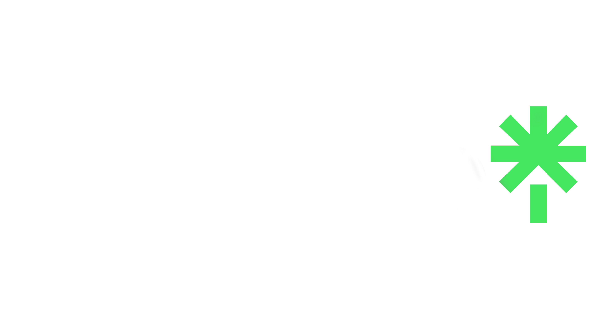

# Hi there 🫵
**I am Kareem (MRX7014),I mostly focus on Frontend and Programming, but I also like to learn ethical hacking and building custom roms and custom recoveries and many other things.**

  
  

<!--Typing  svg-->
<h1 align="center">

</h1>
<!--Typing svg-->

<!--svg-->

<!--svg-->

### Connect with me:

### Languages and Tools:

                                     

🔭 My GitHub stats

 

### 🏆 Github Profile Trophy

### 🔥 Github Streak Stats

