<div id="header" align="center">
  
</div>
<div id="badges"align="center">
  
### Linktree (All My Accounts)

<a href="https://linktr.ee/mrx7014" target="_blank">
    
  </a>
</div>

<div id="header1" align="center">

  
  
  
</div>
<div id="view" align="center">

[](https://git.io/typing-svg)

---
<div align="left">

```bash

### About Me :

- **Name**: MRX7014 (Do not check commits history)
- **Job Title**: Bug Bounty (Still in KG 1) 👶
- **Country**: 🏡 Egypt (probably debugging bugs IRL)
- **Fun Fact**: I am an Octopus 🐙 (8 arms, still can’t multitask properly 🤷)

### 🚀 **Currently Working On**
- 🐞 Catching Bugs (Learning Bug Bounty)
- 🤖 Android Development (Breaking and Fixing ROMs)
- 🐚 Bash Scripting (When copy-paste is not enough)
- 🔧 Playing with Magisk and LSPosed (because why not?)
- 📜 Advanced Linux (becoming a terminal wizard)
- A lot of other things (A Real Octopus)

### 🎮 **Skills**
- 🐧 Linux Setup and Usage (the penguin approves)
- 🖥️ Managing Linux Servers (keeping them alive at 3 AM)
- 🔗 Magisk & LSPosed Modules (like mods for real life)
- 💻 Android Development (because stock is boring)
- etc... ( A Real Octopus again )

### 🤔 **Ask Me About**
- 💻 Technical Support (aka have you tried turning it off and on again ?)
- ⚙️ Operating Systems (Linux is life!)
- 🤖 Android Development (ROMs and Recoveries, brick-free since 2021)
- 📂 ROOT, Termux, and Bash Scripting (Android dark arts)

### Fun Ending:
👋 Thanks for stopping by! Now back to catching bugs... 🐛  
P.S. The script is more stable than my sleep schedule.
```

</div>

---

### :hammer_and_wrench: Languages and Tools :
<div align="center">


  
  
   


</div>

---

### :fire: My Stats :
<div align="center">

[](https://github.com/mrx7014?tab=repositories)

[](https://github.com/mrx7014?tab=repositories) <!--(https://github.com/anuraghazra/github-readme-stats)-->

---

<table><tr><td valign="top" width="50%">

<br>


</td><td valign="top" width="50%">



</td></tr></table>

<table><tr><td valign="top" width="50%">


</td><td valign="top" width="50%">


</td></tr></table>

</details>

---


---


---

 [](https://github.com/mrx7014?tab=repositories)<!--(https://github.com/ryo-ma/github-profile-trophy)-->
</div>

---

### :writing_hand: My Medium Blog  : [/@mrx7014](https://medium.com/@mrx7014)


